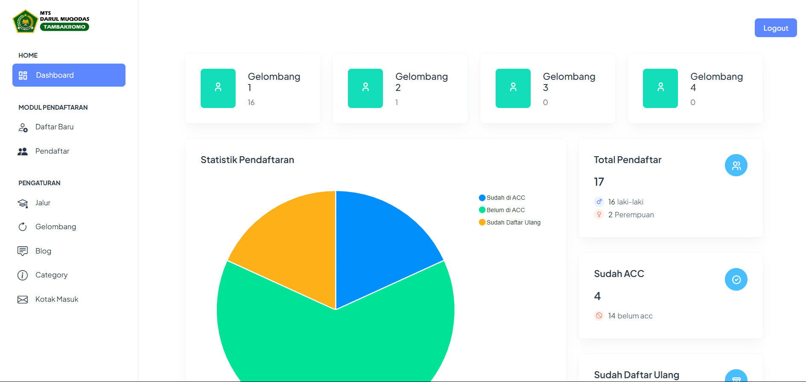

# 🏫 Aplikasi PPDB Online Berbasis Laravel

Aplikasi PPDB (Penerimaan Peserta Didik Baru) ini dibangun menggunakan **Laravel Framework** dan dilengkapi dengan fitur **pemetaan lokasi** menggunakan **Leaflet.js**. Aplikasi ini ditujukan untuk memudahkan proses pendaftaran siswa baru secara online, sekaligus menampilkan visualisasi lokasi rumah calon siswa.

### 🔐 Halaman Admin


## ✨ Fitur

- ✅ Pendaftaran Siswa Baru secara Online
- 📍 Menampilkan Lokasi Rumah Siswa menggunakan Peta Leaflet
- 🔒 Login dan Manajemen Admin
- 📄 Export Data Siswa ke Ms Excell
- 📊 Dashboard Admin untuk melihat statistik pendaftar

## 🛠️ Teknologi yang Digunakan

- **Framework**: Laravel (PHP)
- **Database**: MySQL
- **Frontend**: Blade Template, Bootstrap/Tailwind
- **Pemetaan**: [Leaflet.js](https://leafletjs.com/)

- ## ⚙️ Cara Instalasi
  ```bash
        git clone https://github.com/username/nama-repo-ppdb.git
        cd nama-repo-ppdb
        composer install
        cp .env.example .env
        php artisan key:generate
        php artisan migrate --seed
        php artisa serve

- ## 👤 Login Admin
  ```bash
        http://localhost:xxxx/login
